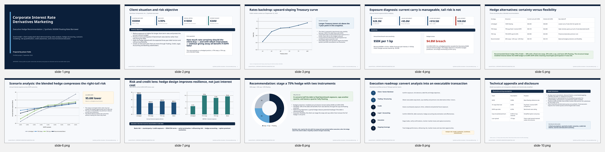

# Corporate Interest Rate Derivatives Marketing Case

## Executive Summary

This portfolio project simulates the work of an analyst supporting a Corporate Derivatives Marketing / Interest Rate Derivatives Sales team. The case evaluates how a synthetic corporate borrower with **$500 million of SOFR-based floating-rate debt** could manage interest-rate risk using swaps, caps, and a blended hedge strategy.

The project demonstrates practical skills in **financial markets, corporate treasury, interest-rate risk, hedge structuring, scenario analysis, pricing logic, credit awareness, executive communication, and cross-functional execution**.

> **Important:** The client, debt profile, swap rate, cap strike, and cap premium are synthetic portfolio assumptions. Treasury yields are sourced from public U.S. Treasury data. This is an educational case study and does not represent executable market pricing or investment advice.

## Client Situation

Northstar Components, Inc. is a synthetic corporate borrower with:

- $500 million of floating-rate debt
- 3-year debt maturity
- SOFR + 175 bps credit spread
- $180 million of annual EBITDA
- $90 million of annual free cash flow
- $34 million illustrative annual interest budget ceiling

The client wants to reduce exposure to higher short-term rates while retaining some benefit if benchmark rates decline.

## Strategies Evaluated

1. **Unhedged:** 100% floating-rate exposure
2. **75% Pay-Fixed Swap:** 75% pay-fixed / receive-SOFR, 25% floating
3. **75% SOFR Cap:** 75% capped at a 4.25% strike, 25% floating
4. **Recommended Blend:** 50% swap + 25% cap + 25% floating

## Key Recommendation

The case recommends a **75% staged hedge** consisting of 50% pay-fixed / receive-SOFR swap, 25% SOFR cap, and 25% remaining floating.

Under the modeled 6.00% SOFR stress scenario, annual interest expense falls from approximately **$38.8 million unhedged to $33.1 million under the blended hedge**, remaining below the illustrative $34 million budget ceiling.

## Deliverables

- [Excel Model](corporate_interest_rate_derivatives_case.xlsx)
- [PowerPoint Pitchbook](corporate_interest_rate_derivatives_pitchbook.pptx)
- [Pitchbook Preview](derivatives_pitchbook_preview.png)

### Excel Model
The workbook includes an Executive Summary, assumptions, U.S. rates market data, a 3-year quarterly interest model, SOFR scenario analysis, risk & credit metrics, and sources/methodology/disclosures.

### PowerPoint Pitchbook
The 10-slide client-ready presentation covers client exposure diagnosis, the U.S. rates backdrop, hedge alternatives, scenario analysis, credit/risk implications, a recommended hedge structure, and an execution roadmap across Sales, Trading, Credit, Legal, Accounting, and Banking.

## Skills Demonstrated

- Interest-rate market analysis
- Yield-curve interpretation
- Corporate debt and treasury analysis
- Interest-rate swap economics
- Interest-rate cap economics
- Hedge-ratio analysis
- Scenario and sensitivity modeling
- Cash interest forecasting
- Benchmark-rate risk quantification
- Credit / interest-coverage analysis
- Customized client presentation development
- Executive-level financial communication
- Cross-functional execution planning
- Excel financial modeling
- PowerPoint pitchbook development

## Market Data and Methodology

Public market context is sourced from:

- U.S. Department of the Treasury — Daily Treasury Par Yield Curve Rates  
  https://home.treasury.gov/resource-center/data-chart-center/interest-rates/
- Federal Reserve Bank of New York — SOFR methodology and reference-rate information  
  https://www.newyorkfed.org/markets/reference-rates/sofr

The Treasury curve snapshot used in the case is dated **September 22, 2026**. Swap and option inputs are deliberately labeled illustrative because executable derivatives pricing would require live dealer quotes and would also incorporate factors such as discount curves, volatility surfaces, bid-offer, collateral, credit valuation adjustments, day-count conventions, and legal documentation.

## Model Limitations

The project intentionally does not model curve bootstrapping, CVA/FVA, bid-offer spreads, CSA collateral economics, full option-volatility surfaces, detailed day-count conventions, hedge-accounting effectiveness testing, tax impacts, or early-termination mark-to-market calculations.

## Author

**Jalaan Fields**  
Financial Strategy & Analytics | Markets, Corporate Finance & Investment Analysis
